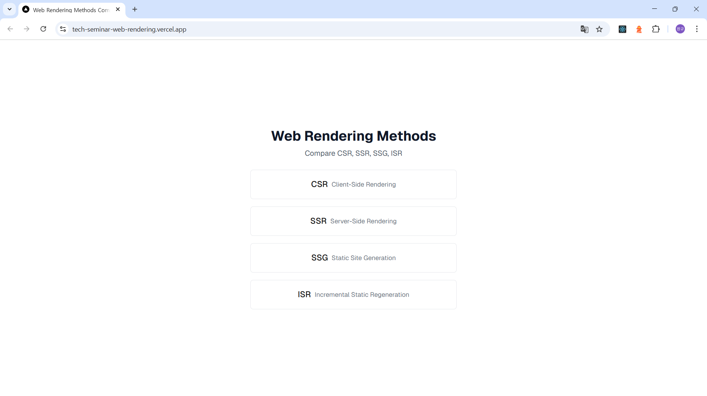

# 웹 렌더링 역사와 흐름

> Next.js를 활용한 웹 렌더링 방식 비교 및 시연 프로젝트



## 🔗 링크
- **Demo Site**: https://tech-seminar-web-rendering.vercel.app/
- **Presentation**: [발표 자료 보기](https://www.canva.com/design/DAGt4KxLWPA/view)

## 📋 개요
이 프로젝트는 CSR, SSR, SSG, ISR 네 가지 웹 렌더링 방식을 실제로 구현하고 비교 분석한 기술 세미나 자료입니다.

## 🚀 시작하기

First, run the development server:

```bash
# 개발 서버 실행
npm run dev

# 브라우저에서 http://localhost:3000 접속
```

##  기술 스택
- Next.js 15
- React
- Vercel

## 🔍 구현된 렌더링 방식
- **CSR** (Client-Side Rendering)
- **SSR** (Server-Side Rendering) 
- **SSG** (Static Site Generation)
- **ISR** (Incremental Static Regeneration)

## 💡 학습 내용

### 성과
- 실제 구현을 통한 렌더링 방식별 차이점 시각화
- ISR(Incremental Static Regeneration) 개념 학습 및 적용
- 각 렌더링 방식의 장단점 체계적 정리

### 개선점
- ISR에 대한 더 깊이 있는 기술적 설명 필요
- 구현 코드에 대한 상세 설명 부족
- 시각적 구분을 위한 UI/UX 개선 필요

## 📚 Resources
- [상세 기술 문서](./docs/technical-details.md)
- [발표 피드백 정리](./docs/feedback-summary.md)
- [개인 회고](./docs/retrospective.md)